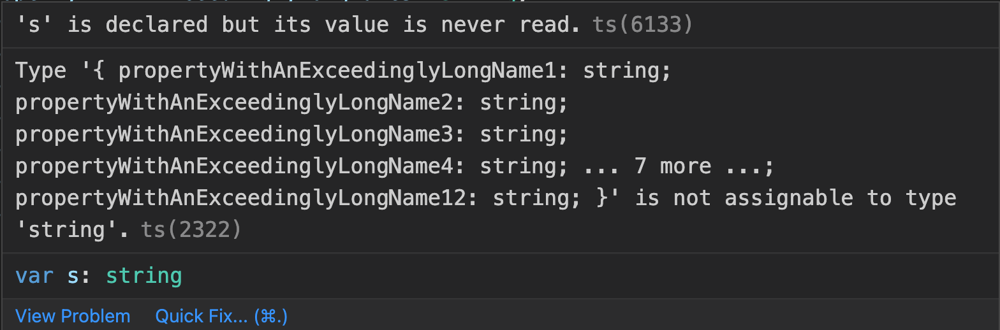
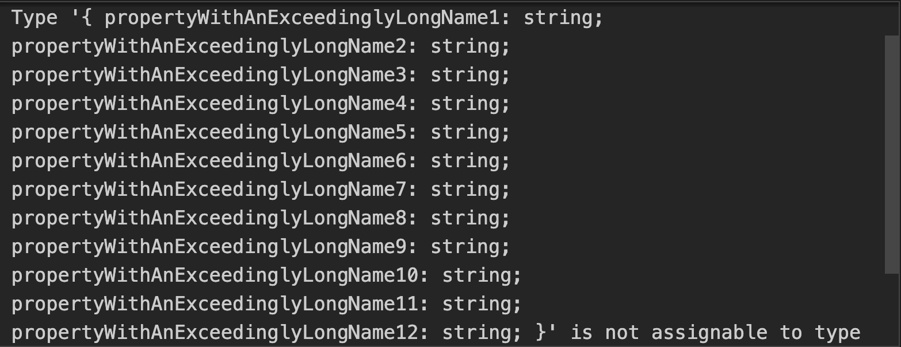

https://github.com/millsp/ts-toolbelt/discussions/264
https://github.com/millsp/ts-toolbelt/blob/master/sources/Any/Compute.ts
https://github.com/millsp/ts-toolbelt/blob/master/sources/index.ts
https://github.com/sindresorhus/type-fest
https://stackoverflow.com/questions/53957170/how-do-i-view-large-typescript-types-in-vscode
https://stackoverflow.com/questions/58565584/how-can-i-see-how-typescript-computes-types
https://github.com/mmkal/ts/blob/main/packages/expect-type/src/index.ts
https://github.com/millsp/ts-toolbelt/blob/319e55123b9571d49f34eca3e5926e41ca73e0f3/sources/Any/Compute.ts
https://stackoverflow.com/questions/57683303/how-can-i-see-the-full-expanded-contract-of-a-typescript-type
https://stackoverflow.com/questions/62508909/vs-code-how-to-show-full-typescript-definition-on-mouse-hover?noredirect=1#comment110551926_62508909

- compute type for debugging
- vscode don't shorten the output size

Всем привет!

Меня зовут Айюб, я фронтенд разработчик в Вики и Формах.

Сегодня хотел бы рассказать про полезные фичи TS, с которыми мало кто знаком, но часто бывают полезны (особенно при написании библиотек).

Давайте начнем, будем идти от простого к сложному.

## Расширение ошибок

При работе с большими объектами и рекурсивными типами, часто можно наткунться на очень большую ошибку.

Однако TypeScript и подсказки в редакторе обычно сокращают их до определенной длины.

Наверника каждый из вас сталкивался с подобной ошибкой:

```ts
declare const x: {
  propertyWithAnExceedinglyLongName1: string;
  propertyWithAnExceedinglyLongName2: string;
  propertyWithAnExceedinglyLongName3: string;
  propertyWithAnExceedinglyLongName4: string;
  propertyWithAnExceedinglyLongName5: string;
  propertyWithAnExceedinglyLongName6: string;
  propertyWithAnExceedinglyLongName7: string;
  propertyWithAnExceedinglyLongName8: string;
  propertyWithAnExceedinglyLongName9: string;
  propertyWithAnExceedinglyLongName10: string;
  propertyWithAnExceedinglyLongName11: string;
  propertyWithAnExceedinglyLongName12: string;
};

// String representation of type of 'x' should be truncated in error message
var s: string = x;
```



Решить эту проблему можно с помощью конфигурации в `tsconfig.json`:

```json
{
  "compilerOptions": {
    // ...
    // other options
    // ...

    "noErrorTruncation": true
  }
}
```

После этого ошибка будет видна в полном виде (из-за скролла ее не видно полностью на скрине):



Также стоит отметить, что при включении данной опции, будет раскрываться не только ошибки, но и любые длинные типы.

<!-- TODO стоит ли добавлять про лишнюю нагрузку на компилятор? -->
<!-- TODO стоит ли добавлять про костыль редактирование ts server'а -->

## Раскрытие типов

Продолжая наш разговор про просмотр типов...

Помимо не полного показа типов, также часто можно столкнуться с проблемой, когда TS показывает тип по его алиасу (имя интерфейса, типа).

Например, давайте рассмотрим пример с вот такой вот функцией:

```ts
function hello
```
